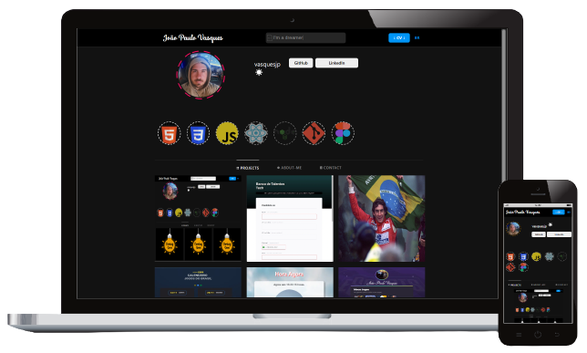

<h1 align="center">
  Portfolio João Paulo Vasques
</h1>

  

 

&nbsp;
 &nbsp;
 

 

# 📰 Description / Descrição

🇺🇸 - The project is a replica of the Instagram layout, initially intended as a way to practice HTML, CSS and Javascript. However, it evolved into a personal website where I showcase some of my projects, share information about my background, and provide my contact information.

 
🇧🇷 - O projeto é uma réplica do layout do Instagram, inicialmente pensado como uma forma de praticar HTML, CSS e Javascript. No entanto, ele evoluiu para um site pessoal onde mostro alguns de meus projetos, compartilho informações sobre meu histórico e forneço minhas informações de contato.

 

# 👷🔧 Built With / Construído Com

🇺🇸 - This project was built using these technologies: 
🇧🇷 - Este Projeto foi construído utilizando essas tecnologias:
- HTML5
- CSS3
- Javascript

 

# ✨ Features / Recursos
## 🇺🇸
- 🌍 Available in Two Languages (EN and PT-BR);
- 🌓 Dark and Light Layout Modes (changed by the user and saved in localStorage);
- 📱 Fully Responsive;

## 🇧🇷
- 🌍 Disponível em Dois Idiomas (EN e PT-BR);
- 🌓 Modos Escuro e Claro do Layout (alterado pelo usuário e salvo no localStorage);
- 📱 Totalmente Responsivo;

# 
